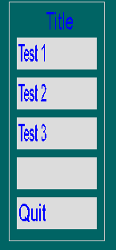

# tiny_ui
This repo contains a small library to generate simple UIs on different platforms. I am using it for my own games.

Currently this works on Windows and Linux. The renderer is based on SDL2. 

A small example:
```cpp
#include <iostream>
#include "widgets.h"

#ifdef main
#  undef main
#endif

using namespace tinyui;

int main(int argc, char *argv[]) {
    tui_context &ctx = tui_context::create("Sample-Screen",  style);

    if (tui_init_screen(ctx, 20, 20, 1024, 768) == -1) {
        printf("Error: Cannot init screen\n");
        return -1;
    }

    tui_style style = get_default_style();
    Widgets::Panel(ctx, 1, 0, 90, 5, 120, 200, nullptr);
    Widgets::Label(ctx, 2, 1, "Title", 100, 10, 100, 20);
    Widgets::Button(ctx, 3, 1, "Test 1", nullptr, 100, 50, 100, 20, nullptr);
    Widgets::Button(ctx, 4, 1, "Test 2", nullptr, 100, 90, 100, 20, nullptr);
    Widgets::Button(ctx, 5, 1, "Test 3", nullptr, 100, 130, 100, 20, nullptr);
    Widgets::Button(ctx, 6, 1, nullptr, nullptr, 100, 170, 100, 20, nullptr);

    while (tui_run(ctx)) {
        tui_begin_render(ctx, style.mClearColor);
        Widgets::renderWidgets(ctx);
        tui_end_render(ctx);
    }
    tui_release(ctx);

    return 0;
}
```
results to

.

Build Status: [](https://github.com/kimkulling/tiny_ui/actions/workflows/cmake.yml)
