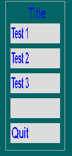

<p align="center">
  
</p>

# tiny_ui

A lightweight C++17 UI library for Windows and Linux, using SDL2 as the renderer.

## Features

- **Widgets**:
  - Panel
  - Button
  - Label
  - Progress Bar
  - TreeView (experimental)
- **Platforms**:
  - Windows
  - Linux

## Build

```bash
# Configure and build
cmake -B build -DCMAKE_BUILD_TYPE=Release
cmake --build build --config Release
```

## Quick Start

```cpp
#include <iostream>
#include "widgets.h"

using namespace tinyui;

static int onQuit(unsigned int id, void *data) {
    auto *ctx = static_cast<Context*>(data);
    ctx->mRequestShutdown = true;
    return ResultOk;
}

int main() {
    Style style = TinyUi::getDefaultStyle();
    Context *ctx = Context::create("Sample", style);

    TinyUi::initScreen(20, 20, 1024, 768);

    Widgets::panel(ctx, RootPanelId, 0, "Dialog", 90, 5, 120, 300, nullptr);
    Widgets::label(ctx, 1, RootPanelId, "Title", 100, 10, 100, 20, Alignment::Center);
    Widgets::button(ctx, 2, RootPanelId, "Quit", nullptr, 100, 50, 100, 40, &onQuit);

    while (TinyUi::run()) {
        TinyUi::beginRender(style.mClearColor);
        Widgets::renderWidgets(ctx);
        TinyUi::endRender();
    }

    TinyUi::release();
    return 0;
}
```

## Running the Sample

```bash
./bin/release/tiny_ui_sample.exe   # Windows
./bin/tiny_ui_sample               # Linux
```



## Planned

- Status Bar, Default dialogs

---

[](https://github.com/kimkulling/tiny_ui/actions/workflows/cmake.yml)
[](https://sonarcloud.io/summary/new_code?id=kimkulling_tiny_ui)
