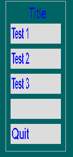

<p align="center">
  
</p>

# tiny_ui

A lightweight C++17 UI library for Windows and Linux, using SDL2 as the renderer.

## Features

- **Widgets**:
  - Panel
  - Button
    - Text
    - Images   
  - Label
  - Progress Bar
  - Imageview
  - Checkboxes
  - TreeView (experimental)
  - Input-Field (experimental)
  - Status Bar
  - Standard-Dialogs
    - Open-File-Dialog
    - Save-File-Dialog
- **Platforms**:
  - Windows
  - Linux

## Build

```bash
# Configure and build
cmake -B build -DCMAKE_BUILD_TYPE=Release
cmake --build build --config Release
```
## Samples

You can check out samples at [Samples-Section](samples/README.md)
## Quick Start

```cpp
int quit(WidgetHandle, void *instance) {
    if (instance != nullptr) {
        auto *ctx = static_cast<Context *>(instance);
        ctx->mRequestShutdown = true;
        return ResultOk;    
    }
    return ErrorCode;
}

int main(int argc, char *argv[]) {
    if (Style style = TinyUi::getDefaultStyle(); !TinyUi::createContext("Sample-Screen", style)) {
        return -1;
    }

    if (TinyUi::initScreen(20, 20, 1024, 768) == -1) {
        const auto &ctx = TinyUi::getContext();
        ctx.mLogger(LogSeverity::Error, "Cannot init screen");
        return ErrorCode;
    }

    constexpr int32_t ButtonHeight = 18;
    WidgetHandle rootPanel = Widgets::panel(WidgetHandle::getRootHandle(), "Sample-Dialog", Rect(90, 5, 220, 60), nullptr);
    if (!panel.isValid()) {
        const auto &ctx = TinyUi::getContext();
        ctx.mLogger(LogSeverity::Error, "Cannot create panel");
        return ErrorCode;
    }
    auto &ctx = TinyUi::getContext();
    auto *dynamicQuitCallback = new CallbackI(quit, (void*) &ctx);

    Widgets::label(rootPanel, "Hi, World!", Rect(100, 10, 200, ButtonHeight), Alignment::Center);
    Widgets::textButton(rootPanel, "Quit", Rect(100, 30, 200, ButtonHeight), Alignment::Center, dynamicQuitCallback);
    while (TinyUi::run()) {
        TinyUi::render();
    }

    TinyUi::release();

    return 0;
}
```

## Running the Sample

```bash
./bin/release/tiny_ui_sample.exe   # Windows
./bin/tiny_ui_sample               # Linux
```



## Planned

- Datagrid
- Selection-Boxes
- Tabs
- Togglebuttons
- Layouter
- Engine Integration
- Tutorials

---

[](https://github.com/kimkulling/tiny_ui/actions/workflows/cmake.yml)
[](https://sonarcloud.io/summary/new_code?id=kimkulling_tiny_ui)
